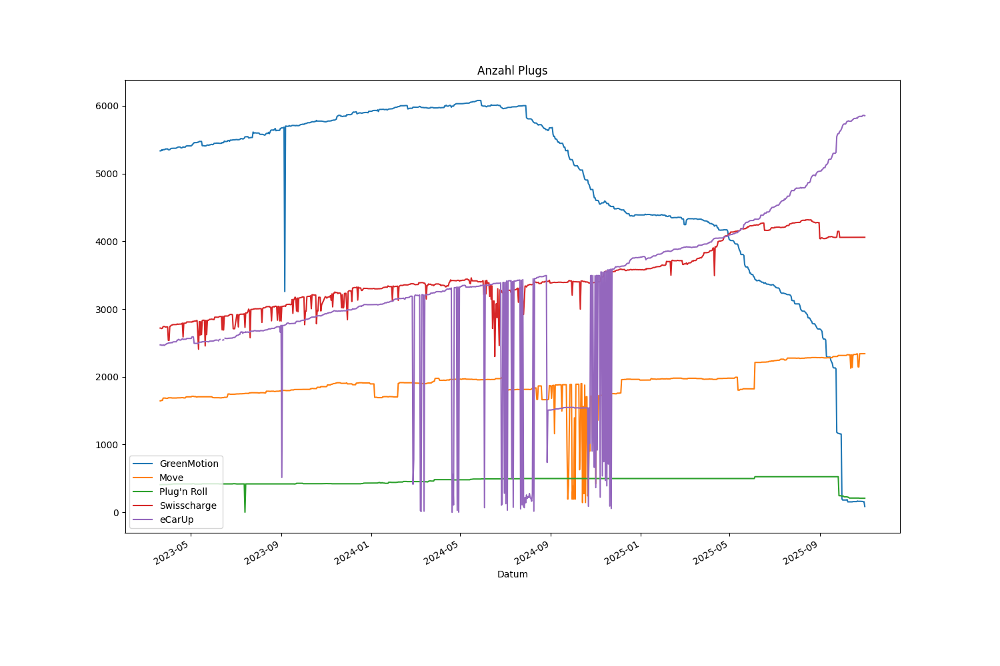
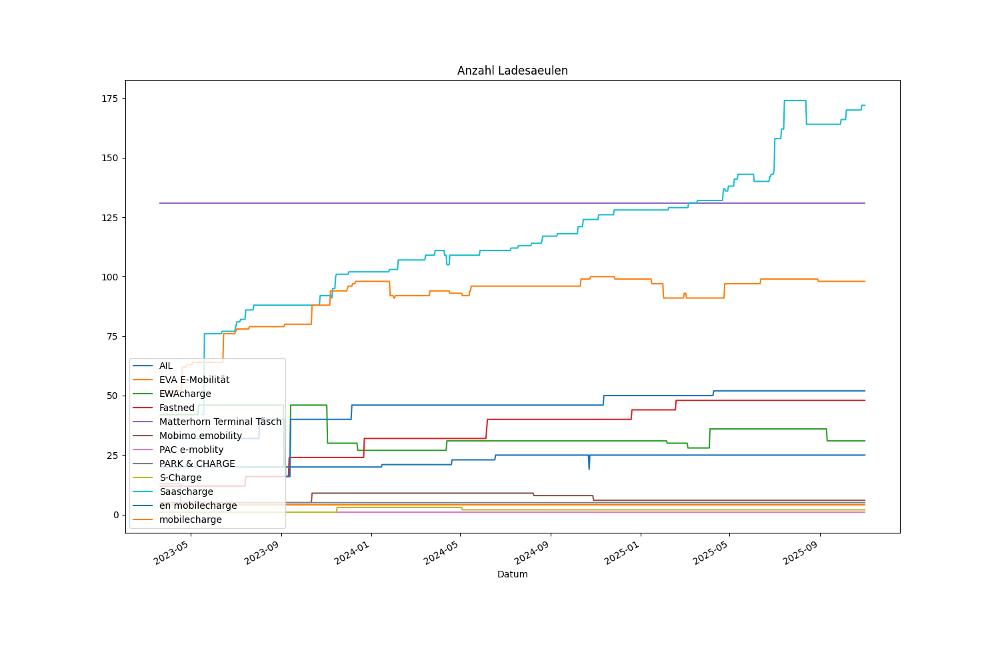
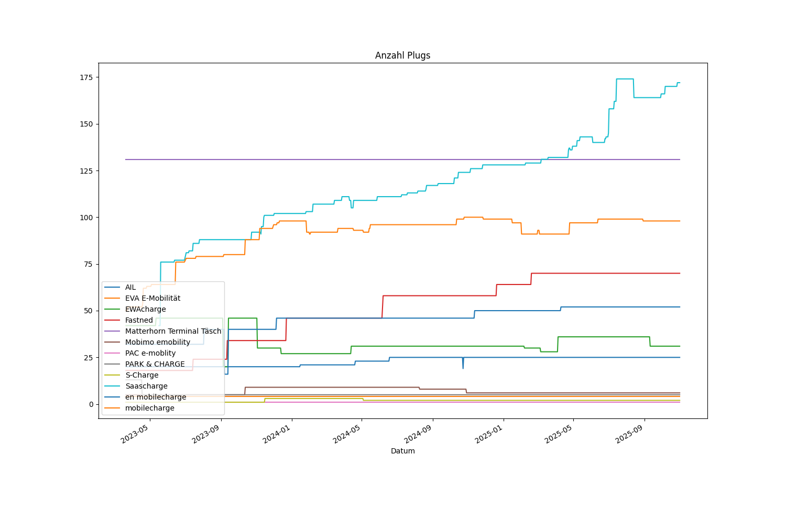
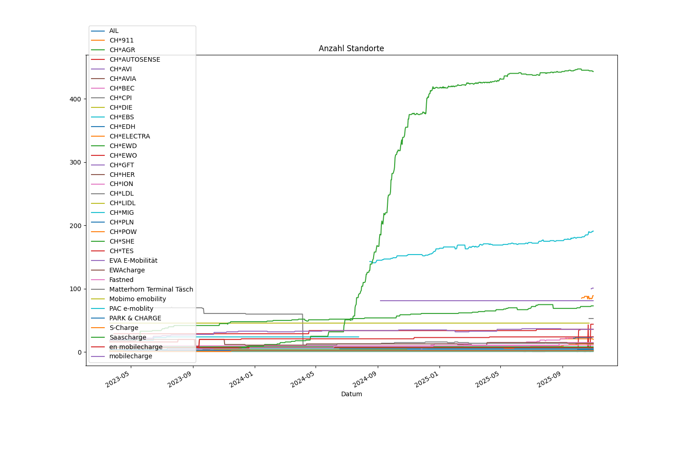
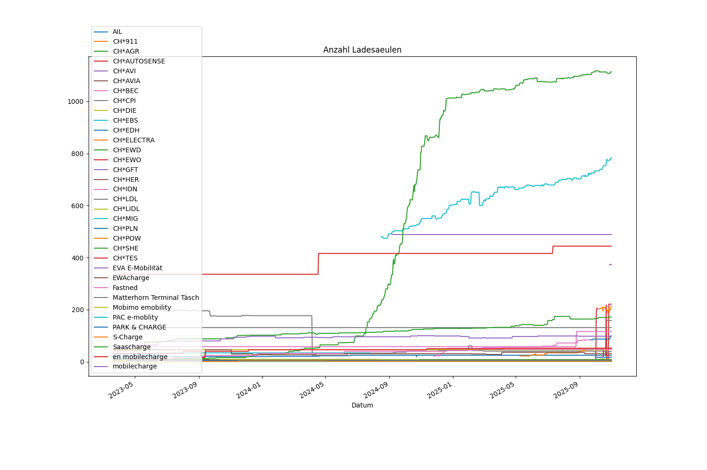
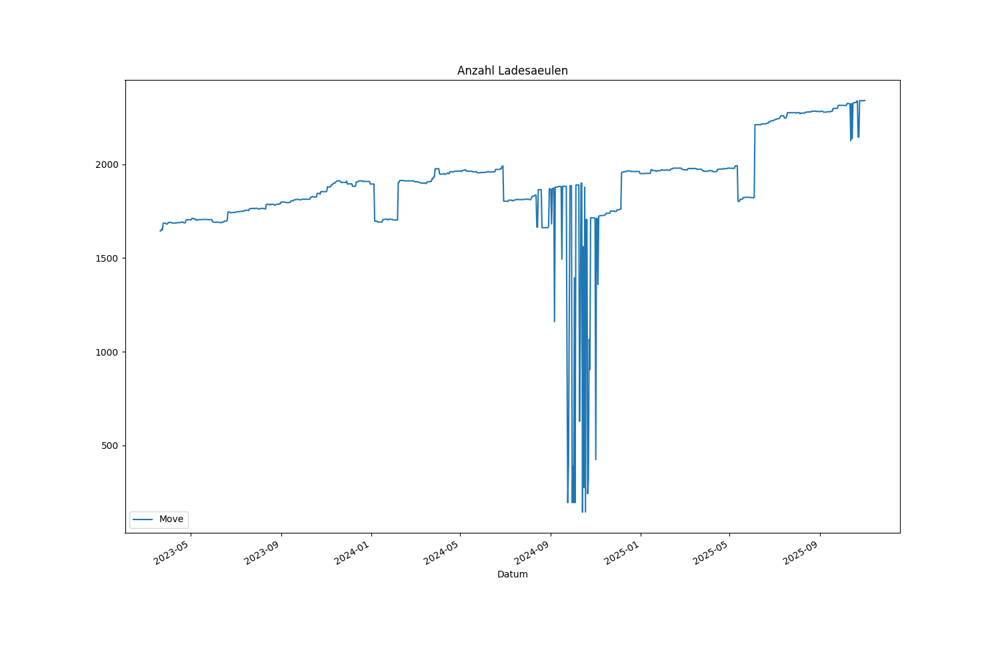
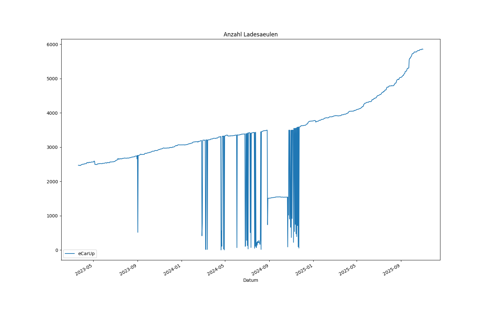
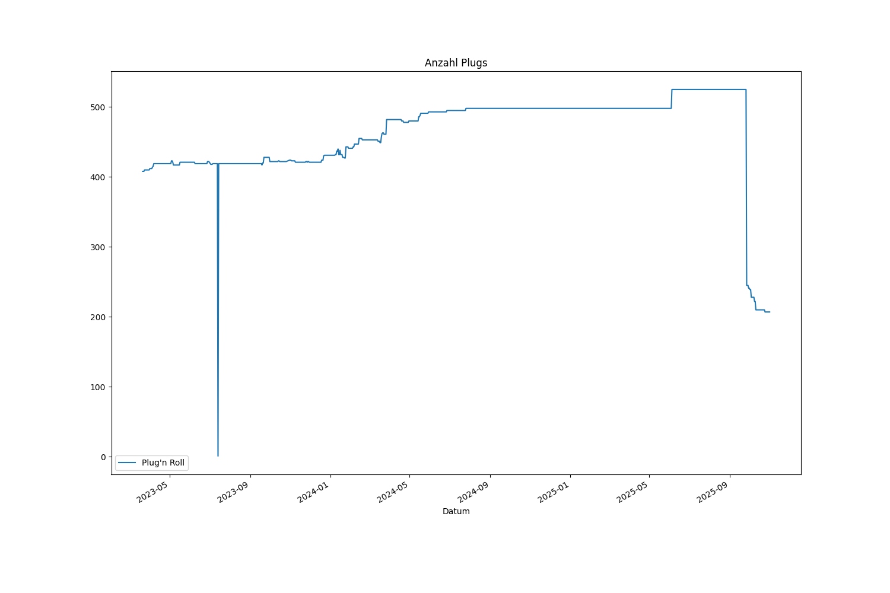

# ich-tanke-strom.ch CPO-Monitoring

- [Big Five](#big-five)
- [CPOs mit Echtzeit-Daten ohne Big Five](#cpos-mit-echtzeit-daten-ohne-big-five)
- [CPOs ohne Echtzeit-Daten](#cpos-ohne-echtzeit-daten)
- [Anzahl Standorte pro CPO](#anzahl-standorte-pro-cpo)
- [Anzahl Ladesäulen pro CPO](#anzahl-ladesäulen-pro-cpo)
- [Anzahl Plugs pro CPO](#anzahl-plugs-pro-cpo)

## Big Five

## CPOs mit Echtzeit-Daten ohne Big Five

## CPOs ohne Echtzeit-Daten

## Anzahl Standorte pro CPO

## Anzahl Ladesäulen pro CPO

## Anzahl Plugs pro CPO

