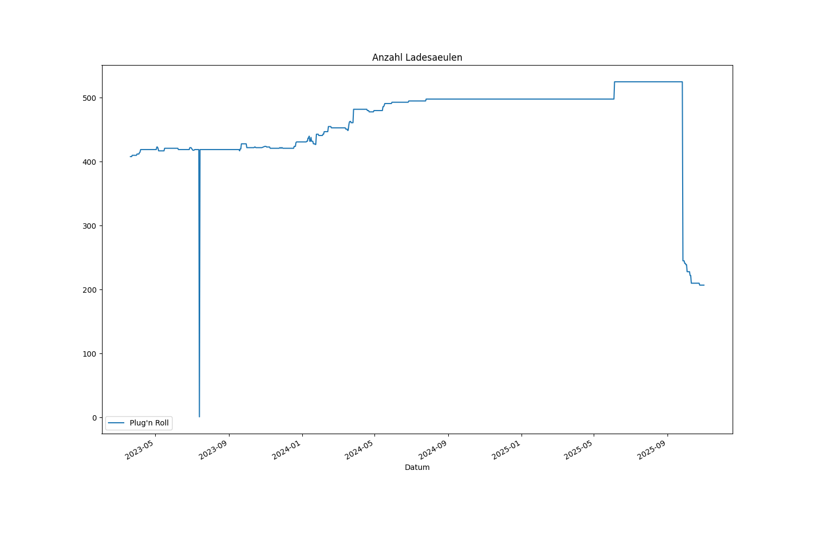
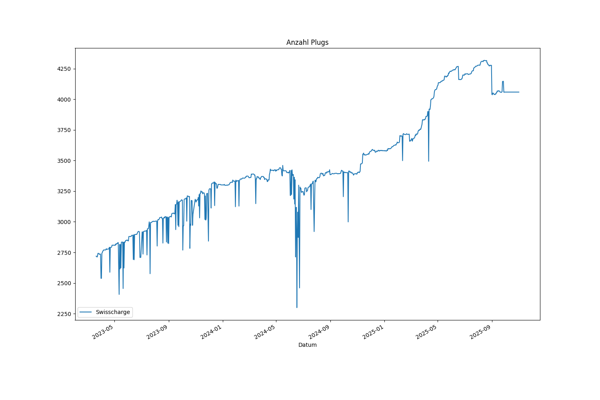

# ich-tanke-strom.ch CPO-Monitoring

- [Alle CPOs zusammen](#alle-cpos-zusammen)
- [Anzahl Standorte pro CPO](#anzahl-standorte-pro-cpo)
- [Anzahl Ladesäulen pro CPO](#anzahl-ladesäulen-pro-cpo)
- [Anzahl Plugs pro CPO](#anzahl-plugs-pro-cpo)

## Alle CPOs zusammen

## Anzahl Standorte pro CPO

## Anzahl Ladesäulen pro CPO

## Anzahl Plugs pro CPO

